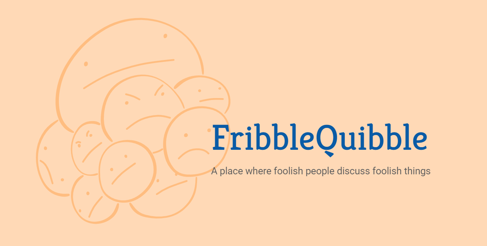

   
   

      <strong>Frontend repository for the FribbleQuibble discussion website.</strong>
   

## Development Environment
- Vite + SWC
- React
- TypesScript
- styled-components

## Publishing
The FribbleQuibble frontend website is published through Netlify which automatically checks for updates from the repository. Any pushes to the `main` branch will launch an automatic rebuild of the site.
